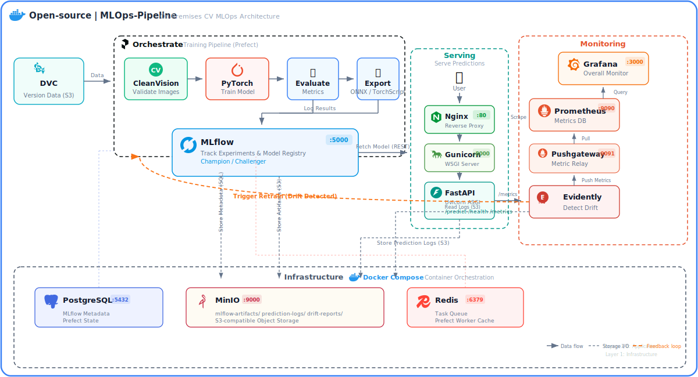
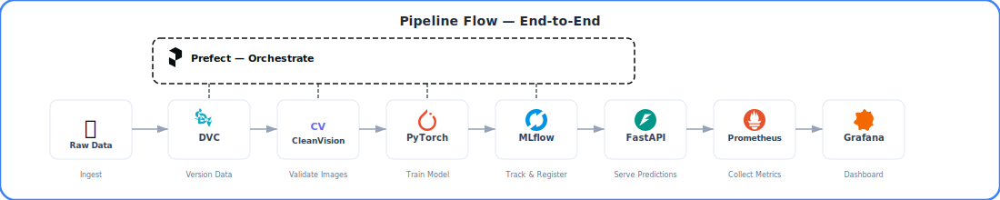
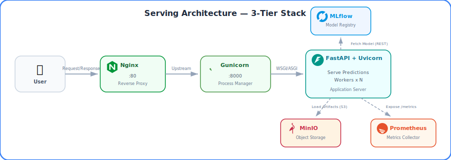
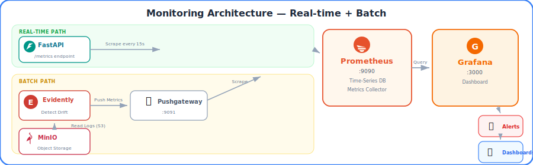

# MLOps Pipeline


> 온프레미스 환경을 위한 범용 컴퓨터 비전 MLOps 파이프라인 템플릿.
> 이미지 분류, 객체 탐지, 세그멘테이션 워크플로우를 지원합니다.
> 학습부터 서빙, 모니터링까지 ML 모델의 전체 라이프사이클을 관리합니다.

## 주요 특징

- **6-Layer 아키텍처** -- 인프라부터 모니터링까지 관심사를 명확히 분리한 레이어 구조
- **온프레미스 최적화** -- 클라우드 종속 없이 Docker Compose만으로 전체 스택 배포
- **실험 추적 및 모델 레지스트리** -- MLflow로 실험 비교, 모델 버전 관리, 아티팩트 저장
- **자동화된 파이프라인** -- Prefect로 데이터 검증, 학습, 배포를 하나의 워크플로우로 오케스트레이션
- **프로덕션 서빙** -- Nginx + Gunicorn + FastAPI 3-tier 구조로 안정적인 추론 API 제공
- **데이터 품질 관리** -- CleanLab, CleanVision으로 학습 데이터의 라벨 오류 및 이미지 이상 자동 탐지
- **실시간 + 배치 모니터링** -- Prometheus 메트릭 수집과 Evidently 드리프트 감지를 Grafana에서 통합 시각화
- **GPU 지원** -- CUDA 12.6 기반 GPU 학습 및 추론 지원 (docker-compose.override.yml)

## 아키텍처

<p align="center">
  
</p>

## 파이프라인 흐름

<p align="center">
  
</p>

## 서빙 아키텍처

<p align="center">
  
</p>

## 모니터링

<p align="center">
  
</p>

## 기술 스택

| 구분 | 기술 | 버전 |
|------|------|------|
| PostgreSQL | `postgres` | 16.6-alpine |
| MinIO Server | `minio/minio` | RELEASE.2025-09-07 |
| MinIO Client | `minio/mc` | RELEASE.2025-08-13 |
| MLflow | `ghcr.io/mlflow/mlflow` (커스텀 빌드) | v3.10.1 |
| Prefect | `prefecthq/prefect` | 3.6.23-python3.11 |
| Redis | `redis` | 7.4-alpine |
| Nginx | `nginx` | 1.28.1-alpine |
| FastAPI | `fastapi` + `uvicorn` + `gunicorn` | 0.115+ / 0.30+ / 22.0+ |
| Prometheus | `prom/prometheus` | v3.10.0 |
| Pushgateway | `prom/pushgateway` | v1.11.0 |
| Grafana | `grafana/grafana-oss` | 12.4.1 |
| Python | - | 3.11.x |
| PyTorch | - | 2.6.x |
| CUDA | `nvidia/cuda` | 12.6.3-runtime-ubuntu22.04 |

## 빠른 시작

### 사전 요구사항

- Docker & Docker Compose v2
- Python 3.11+
- [uv](https://docs.astral.sh/uv/) (Python 패키지 매니저)
- GPU 사용 시: NVIDIA Driver + NVIDIA Container Toolkit

### 설치 및 실행

```bash
git clone <repo-url>
cd MLOps-Pipeline

# Python 의존성 설치
uv sync

# 환경변수 설정 (포트 충돌 시 .env에서 조정)
cp .env.example .env

# 전체 서비스 시작
make up

# 버킷 초기화 + MLflow 실험 생성
make seed

# 13-point 상태 확인
make verify
```

## 서비스 접속

| 서비스 | URL | 비고 |
|--------|-----|------|
| MLflow UI | http://localhost:5000 | 실험 추적, 모델 레지스트리 |
| Prefect UI | http://localhost:4200 | 워크플로우 관리 |
| MinIO Console | http://localhost:9001 | minioadmin / minioadmin123 |
| MinIO API | http://localhost:9000 | S3 호환 API |
| Inference API | http://localhost:8000 | FastAPI (직접 접근) |
| Nginx | http://localhost:80 | 리버스 프록시 (권장 진입점) |
| Prometheus | http://localhost:9090 | 메트릭 조회 |
| Pushgateway | http://localhost:9091 | 배치 메트릭 수신 |
| Grafana | http://localhost:3000 | admin / admin |
| PostgreSQL | localhost:5432 | mlops / mlops_secret |
| Redis | localhost:6379 | - |

## 문서

| 문서 | 설명 |
|------|------|
| [아키텍처](docs/architecture.md) | 시스템 구조, 데이터 플로우, 레이어 요약 |
| [설치 가이드](docs/setup-guide.md) | 설치, 실행, Make 명령어, 문제 해결 |
| [Layer 1: Infrastructure](docs/layer-1-infrastructure.md) | Docker Compose, PostgreSQL, MinIO, Redis |
| [Layer 2: Data Pipeline](docs/layer-2-data-pipeline.md) | DVC, CleanVision, CleanLab |
| [Layer 3: Training](docs/layer-3-training.md) | PyTorch, MLflow 통합 |
| [Layer 4: Orchestration](docs/layer-4-orchestration.md) | Prefect 워크플로우 |
| [Layer 5: Serving](docs/layer-5-serving.md) | FastAPI, Gunicorn, Nginx, API 사용법 |
| [Layer 6: Monitoring](docs/layer-6-monitoring.md) | Evidently, Prometheus, Grafana |

## 라이선스

MIT License
