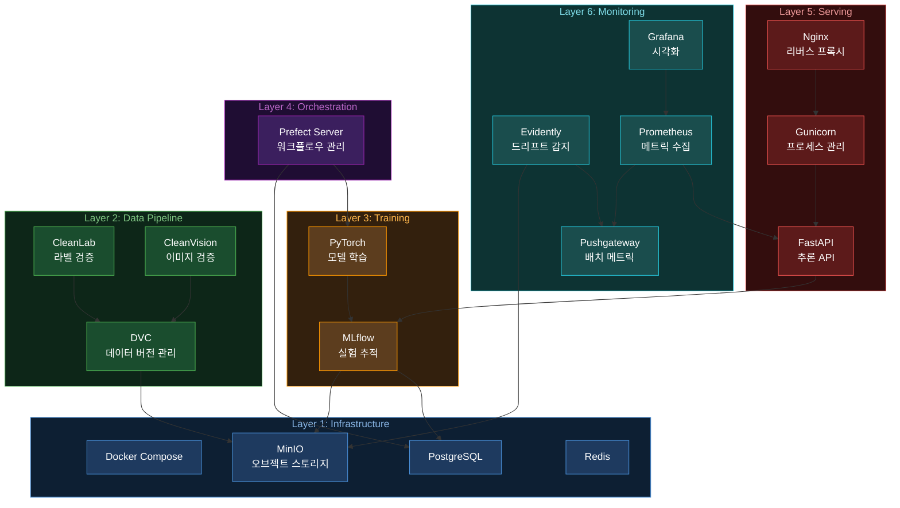
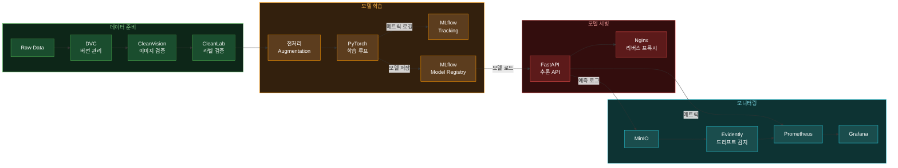
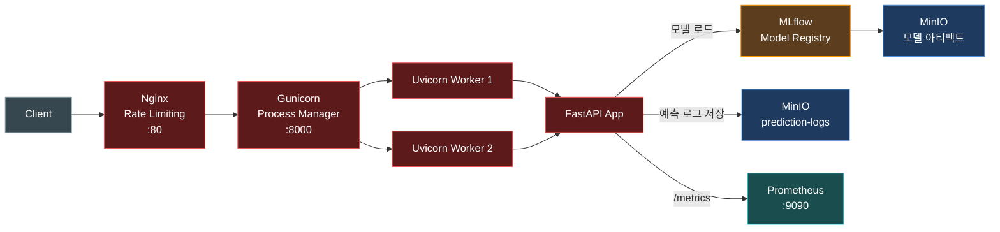
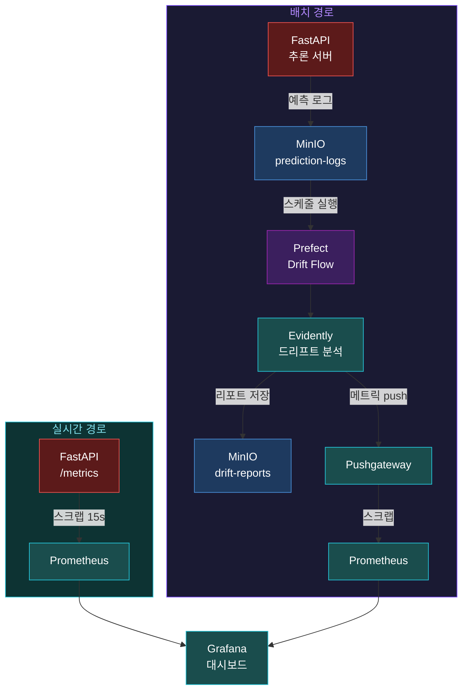

# MLOps Pipeline


> 온프레미스 환경을 위한 범용 컴퓨터 비전 MLOps 파이프라인 템플릿.
> 이미지 분류, 객체 탐지, 세그멘테이션 워크플로우를 지원합니다.
> 학습부터 서빙, 모니터링까지 ML 모델의 전체 라이프사이클을 관리합니다.

## 주요 특징

- **6-Layer 아키텍처** -- 인프라부터 모니터링까지 관심사를 명확히 분리한 레이어 구조
- **온프레미스 최적화** -- 클라우드 종속 없이 Docker Compose만으로 전체 스택 배포
- **실험 추적 및 모델 레지스트리** -- MLflow로 실험 비교, 모델 버전 관리, 아티팩트 저장
- **자동화된 파이프라인** -- Prefect로 데이터 검증, 학습, 배포를 하나의 워크플로우로 오케스트레이션
- **프로덕션 서빙** -- Nginx + Gunicorn + FastAPI 3-tier 구조로 안정적인 추론 API 제공
- **데이터 품질 관리** -- CleanLab, CleanVision으로 학습 데이터의 라벨 오류 및 이미지 이상 자동 탐지
- **실시간 + 배치 모니터링** -- Prometheus 메트릭 수집과 Evidently 드리프트 감지를 Grafana에서 통합 시각화
- **GPU 지원** -- CUDA 12.6 기반 GPU 학습 및 추론 지원 (docker-compose.override.yml)

## 아키텍처



## 파이프라인 흐름



## 서빙 아키텍처



## 모니터링



## 기술 스택

| 구분 | 기술 | 버전 |
|------|------|------|
| PostgreSQL | `postgres` | 16.6-alpine |
| MinIO Server | `minio/minio` | RELEASE.2025-09-07 |
| MinIO Client | `minio/mc` | RELEASE.2025-08-13 |
| MLflow | `ghcr.io/mlflow/mlflow` (커스텀 빌드) | v3.10.1 |
| Prefect | `prefecthq/prefect` | 3.6.23-python3.11 |
| Redis | `redis` | 7.4-alpine |
| Nginx | `nginx` | 1.28.1-alpine |
| FastAPI | `fastapi` + `uvicorn` + `gunicorn` | 0.115+ / 0.30+ / 22.0+ |
| Prometheus | `prom/prometheus` | v3.10.0 |
| Pushgateway | `prom/pushgateway` | v1.11.0 |
| Grafana | `grafana/grafana-oss` | 12.4.1 |
| Python | - | 3.11.x |
| PyTorch | - | 2.6.x |
| CUDA | `nvidia/cuda` | 12.6.3-runtime-ubuntu22.04 |

## 빠른 시작

### 사전 요구사항

- Docker & Docker Compose v2
- Python 3.11+
- [uv](https://docs.astral.sh/uv/) (Python 패키지 매니저)
- GPU 사용 시: NVIDIA Driver + NVIDIA Container Toolkit

### 설치 및 실행

```bash
git clone <repo-url>
cd MLOps-Pipeline

# Python 의존성 설치
uv sync

# 환경변수 설정 (포트 충돌 시 .env에서 조정)
cp .env.example .env

# 전체 서비스 시작
make up

# 버킷 초기화 + MLflow 실험 생성
make seed

# 13-point 상태 확인
make verify
```

## 서비스 접속

| 서비스 | URL | 비고 |
|--------|-----|------|
| MLflow UI | http://localhost:5000 | 실험 추적, 모델 레지스트리 |
| Prefect UI | http://localhost:4200 | 워크플로우 관리 |
| MinIO Console | http://localhost:9001 | minioadmin / minioadmin123 |
| MinIO API | http://localhost:9000 | S3 호환 API |
| Inference API | http://localhost:8000 | FastAPI (직접 접근) |
| Nginx | http://localhost:80 | 리버스 프록시 (권장 진입점) |
| Prometheus | http://localhost:9090 | 메트릭 조회 |
| Pushgateway | http://localhost:9091 | 배치 메트릭 수신 |
| Grafana | http://localhost:3000 | admin / admin |
| PostgreSQL | localhost:5432 | mlops / mlops_secret |
| Redis | localhost:6379 | - |

## API 사용법

### 헬스 체크

```bash
curl http://localhost/health
```

```json
{
  "status": "ok",
  "model_loaded": true
}
```

### 모델 정보 조회

```bash
curl http://localhost/model/info
```

```json
{
  "model_name": "cv-classifier",
  "model_version": "1",
  "num_classes": 10,
  "device": "cpu",
  "image_size": 224
}
```

### 이미지 추론

```bash
curl -X POST http://localhost/predict \
  -F "file=@image.jpg"
```

```json
{
  "predicted_class": 3,
  "class_name": "cat",
  "confidence": 0.95,
  "probabilities": [0.01, 0.01, 0.02, 0.95, 0.01]
}
```

### 모델 리로드

```bash
curl -X POST http://localhost/model/reload \
  -H "Content-Type: application/json" \
  -d '{"model_name": "cv-classifier", "model_version": "2"}'
```

```json
{
  "status": "ok",
  "message": "Reloaded model 'cv-classifier' version '2'",
  "model_info": {
    "model_name": "cv-classifier",
    "model_version": "2",
    "num_classes": 10,
    "device": "cpu",
    "image_size": 224
  }
}
```

## 프로젝트 구조

```
MLOps-Pipeline/
├── docker-compose.yml          # 전체 서비스 정의
├── docker-compose.override.yml # GPU/개발 오버라이드
├── Makefile                    # 공통 명령어
├── pyproject.toml              # Python 프로젝트 설정
├── .env.example                # 환경변수 템플릿
├── docker/                     # 서비스별 Dockerfile
│   ├── mlflow/                 # MLflow (+ psycopg2, boto3)
│   ├── serving/                # FastAPI + Gunicorn
│   ├── nginx/                  # 리버스 프록시
│   └── monitoring/             # 모니터링 서비스
├── src/                        # 소스 코드 (레이어별)
│   ├── data/                   # Layer 2: 전처리, 검증
│   │   ├── preprocessing/      # 이미지 변환 (augmentation)
│   │   └── validation/         # CleanVision, CleanLab
│   ├── training/               # Layer 3: 모델 학습
│   │   ├── configs/            # TrainConfig (Pydantic)
│   │   ├── models/             # 분류기 생성 (ResNet, EfficientNet, MobileNet)
│   │   └── trainers/           # 학습 루프 + MLflow 트래킹
│   ├── orchestration/          # Layer 4: 워크플로우 관리
│   │   ├── flows/              # Prefect 파이프라인
│   │   └── tasks/              # 데이터/학습 태스크
│   ├── serving/                # Layer 5: 모델 서빙
│   │   ├── api/                # FastAPI 앱, 라우트, 스키마
│   │   ├── gunicorn/           # 워커 설정
│   │   └── nginx/              # Nginx 설정
│   └── monitoring/             # Layer 6: 관측성
│       └── evidently/          # 드리프트 감지
├── configs/                    # 서비스 설정 파일
│   ├── prometheus/             # Prometheus 스크랩 설정
│   ├── grafana/                # 대시보드, 데이터소스
│   └── nginx/                  # Nginx 메인 설정
├── tests/                      # 테스트
│   ├── unit/                   # 단위 테스트
│   ├── integration/            # 통합 테스트
│   └── e2e/                    # E2E 테스트
├── scripts/                    # 초기화 스크립트
├── examples/                   # 예제 스크립트
└── docs/                       # 문서 (Korean)
```

## Make 명령어

| 명령어 | 설명 |
|--------|------|
| `make install` | 의존성 설치 (uv sync) |
| `make up` | 전체 서비스 시작 |
| `make down` | 전체 서비스 중지 |
| `make down-v` | 서비스 중지 + 볼륨 삭제 |
| `make ps` | 서비스 상태 확인 |
| `make logs SERVICE=mlflow` | 서비스 로그 확인 |
| `make seed` | MinIO 버킷 및 MLflow 실험 초기화 |
| `make train` | 기본 설정으로 학습 실행 |
| `make pipeline` | 전체 파이프라인 1회 실행 (데이터 → 검증 → 학습) |
| `make pipeline-serve` | 스케줄 파이프라인 서빙 (기본: 주 1회) |
| `make lint` | Ruff 린터 실행 |
| `make format` | Ruff 포매터 실행 |
| `make test` | 단위 테스트 실행 |
| `make test-integration` | 통합 테스트 실행 |
| `make test-e2e` | E2E 테스트 실행 |
| `make verify` | 인프라 상태 점검 |
| `make drift-check` | 드리프트 감지 수동 실행 |

## 지원 모델

| 모델 | 설명 | 파라미터 수 |
|------|------|------------|
| ResNet-18 | 기본 모델 | 11.7M |
| ResNet-34 | | 21.8M |
| ResNet-50 | | 25.6M |
| EfficientNet-B0 | 효율적 아키텍처 | 5.3M |
| EfficientNet-B1 | | 7.8M |
| MobileNet V3 Small | 모바일/엣지 | 2.5M |
| MobileNet V3 Large | | 5.5M |

## 문서

| 문서 | 설명 |
|------|------|
| [아키텍처](docs/architecture.md) | 전체 시스템 구조 및 데이터 흐름 다이어그램 |
| [설치 가이드](docs/setup-guide.md) | 사전 요구사항 및 설치/실행 방법 |
| [Layer 1: Infrastructure](docs/layer-1-infrastructure.md) | Docker Compose, PostgreSQL, MinIO, Redis 상세 |
| [Layer 2: Data Pipeline](docs/layer-2-data-pipeline.md) | DVC, CleanLab, CleanVision 데이터 파이프라인 상세 |
| [Layer 3: Training](docs/layer-3-training.md) | PyTorch 학습 루프, MLflow 트래킹 상세 |
| [Layer 4: Orchestration](docs/layer-4-orchestration.md) | Prefect 워크플로우 오케스트레이션 상세 |
| [Layer 5: Serving](docs/layer-5-serving.md) | FastAPI, Gunicorn, Nginx 서빙 레이어 상세 |
| [Layer 6: Monitoring](docs/layer-6-monitoring.md) | Evidently, Prometheus, Grafana 모니터링 상세 |
| [개선 사항](docs/improvements.md) | 프로젝트 개선 기록 |

## 라이선스

MIT License
