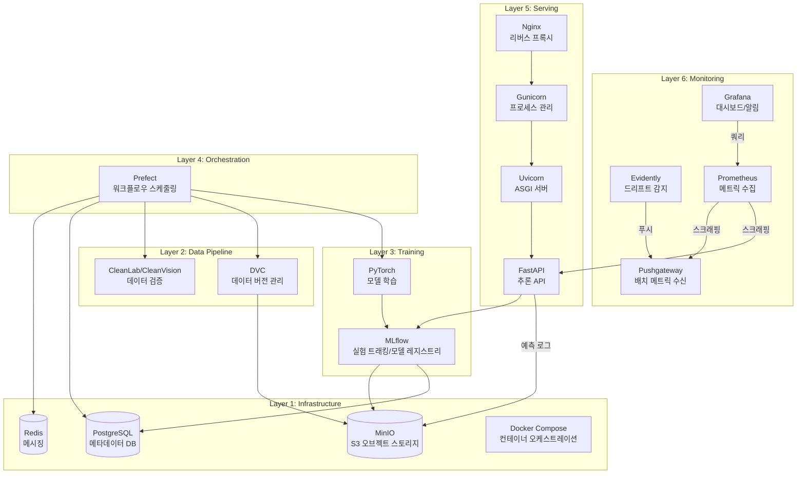
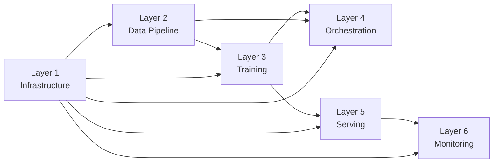

# 아키텍처

## 시스템 개요



## 레이어 의존성



**규칙:** 상위 레이어는 하위 레이어만 참조 가능. 역방향 의존성 금지.

> Layer 5(Serving)는 Layer 4(Orchestration)에 의존하지 않습니다. 모델 배포는 MLflow 모델 레지스트리를 통해 트리거됩니다.

## 데이터 흐름


## 레이어별 요약

### Layer 1: Infrastructure
Docker Compose로 관리되는 기반 인프라. PostgreSQL(메타데이터), MinIO(S3 오브젝트 스토리지), Redis(메시징)를 제공한다.
MLflow와 Prefect 서버가 이 인프라 위에서 동작한다. → [상세](layer-1-infrastructure.md)

### Layer 2: Data Pipeline
DVC로 데이터셋 버전 관리, CleanVision으로 이미지 품질 검증, CleanLab으로 라벨 품질 검증.
전처리 파이프라인(augmentation, normalization)을 제공한다. → [상세](layer-2-data-pipeline.md)

### Layer 3: Training
PyTorch 기반 이미지 분류 학습. 7개 모델 아키텍처 지원 (ResNet, EfficientNet, MobileNet).
MLflow로 실험 추적, 하이퍼파라미터 로깅, 모델 레지스트리 등록을 수행한다. → [상세](layer-3-training.md)

### Layer 4: Orchestration
Prefect 기반 워크플로우 오케스트레이션. 학습 파이프라인(데이터 준비→검증→학습)과 모니터링 파이프라인(드리프트 감지)을 관리한다.
데이터 품질 게이트(health_score 기반)와 cron 스케줄링을 제공한다. → [상세](layer-4-orchestration.md)

### Layer 5: Serving
Nginx → Gunicorn → Uvicorn → FastAPI 3-tier 추론 API.
MLflow Model Registry에서 모델을 로드하고, 무중단 모델 교체(hot reload)를 지원한다. → [상세](layer-5-serving.md)

### Layer 6: Monitoring
실시간 Prometheus 메트릭 수집과 Evidently 배치 드리프트 감지를 Grafana에서 통합 시각화.
예측 로그를 MinIO에 저장하고, Prefect 스케줄로 드리프트 분석을 자동화한다. → [상세](layer-6-monitoring.md)

## 프로젝트 구조

```
MLOps-Pipeline/
├── docker-compose.yml        # 전체 서비스 정의
├── Makefile                  # 공통 명령어
├── pyproject.toml            # Python 프로젝트 설정
├── docker/                   # 서비스별 Dockerfile
│   ├── minio/                # MinIO (커스텀 이미지 + mc CLI)
│   ├── mlflow/               # MLflow (+ psycopg2, boto3)
│   ├── serving/              # FastAPI + Gunicorn
│   ├── nginx/                # 리버스 프록시
│   └── monitoring/           # Evidently 러너
├── src/                      # 소스 코드 (레이어별)
│   ├── data/                 # Layer 2: 전처리, 검증
│   ├── training/             # Layer 3: 모델 학습
│   ├── orchestration/        # Layer 4: Prefect 워크플로우
│   ├── serving/              # Layer 5: 추론 API
│   └── monitoring/           # Layer 6: 메트릭, 드리프트
├── configs/                  # 서비스 설정 (Prometheus, Grafana, Nginx)
├── tests/                    # unit, integration, e2e
├── scripts/                  # 초기화 스크립트
└── docs/                     # 문서 (Korean)
```

## 서비스 포트 맵

| 서비스 | 포트 | 용도 |
|--------|------|------|
| PostgreSQL | 5432 | 메타데이터 DB |
| MinIO API | 9000 | S3 호환 API |
| MinIO Console | 9001 | 웹 관리 UI |
| MLflow | 5000 | 실험 트래킹 UI + API |
| Prefect | 4200 | 오케스트레이션 UI + API |
| Redis | 6379 | Prefect 메시징 |
| FastAPI | 8000 | 추론 API |
| Nginx | 80 | 리버스 프록시 |
| Prometheus | 9090 | 메트릭 수집 |
| Pushgateway | 9091 | 배치 메트릭 수신 |
| Grafana | 3000 | 대시보드 |
