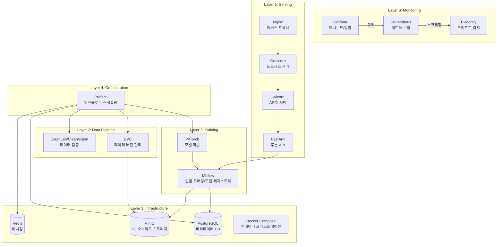
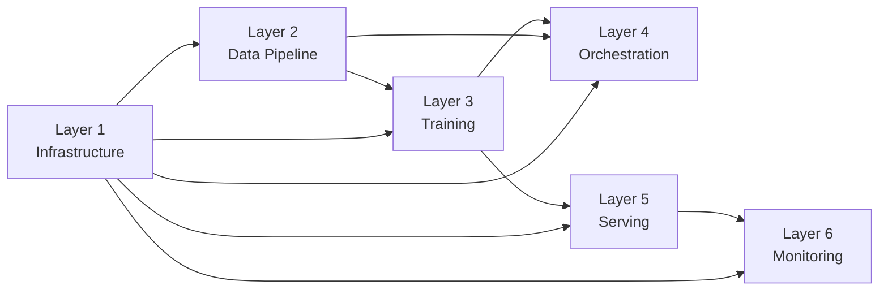

# 아키텍처

## 전체 시스템 구조

## 레이어 의존성

**규칙:** 상위 레이어는 하위 레이어만 참조 가능. 역방향 의존성 금지.

> Layer 5(Serving)는 Layer 4(Orchestration)에 의존하지 않습니다. 모델 배포는 MLflow 모델 레지스트리를 통해 트리거됩니다.

## 서비스 포트 맵

| 서비스 | 포트 | 용도 |
|--------|------|------|
| PostgreSQL | 5432 | 메타데이터 DB |
| MinIO API | 9000 | S3 호환 API |
| MinIO Console | 9001 | 웹 관리 UI |
| MLflow | 5000 | 실험 트래킹 UI + API |
| Prefect | 4200 | 오케스트레이션 UI + API |
| Redis | 6379 | Prefect 메시징 |
| FastAPI | 8000 | 추론 API (Phase 5) |
| Nginx | 80 | 리버스 프록시 (Phase 5) |
| Prometheus | 9090 | 메트릭 수집 (Phase 6) |
| Grafana | 3000 | 대시보드 (Phase 6) |

## 데이터 흐름

## 구현 로드맵

| Phase | 레이어 | 핵심 구현 |
|-------|--------|----------|
| 0 | 프로젝트 기반 | CLAUDE.md, docs, Makefile, pyproject.toml |
| 1 | Infrastructure | Docker Compose, PostgreSQL, MinIO, MLflow Server, Prefect Server, Redis |
| 2 | Data Pipeline | DVC (MinIO 리모트), CleanLab/CleanVision, 데모 데이터셋 |
| 3 | Training | PyTorch 이미지 분류, MLflow 실험 트래킹, 모델 레지스트리 |
| 4 | Orchestration | Prefect 워크플로우, 스케줄링, 에러 핸들링 |
| 5 | Serving | FastAPI, Gunicorn/Uvicorn, Nginx, 모델 버전 라우팅 |
| 6 | Monitoring | Evidently 드리프트, Prometheus 메트릭, Grafana 대시보드 |
