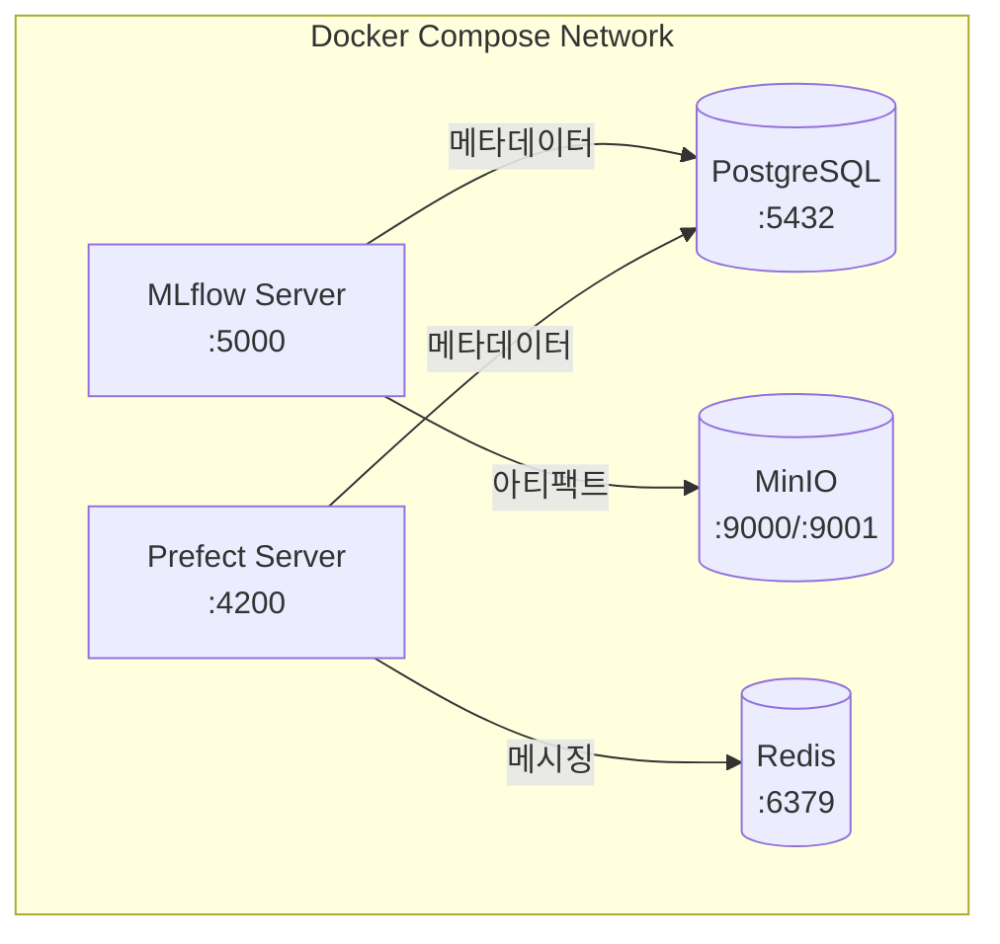
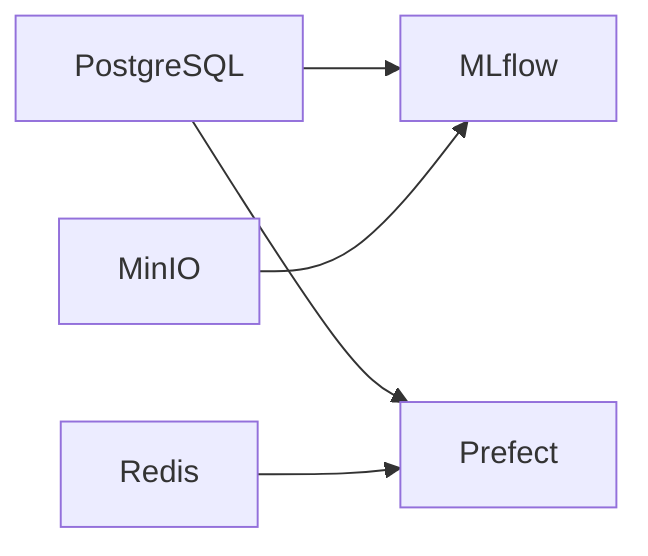

# Layer 1: Infrastructure

## 개요

모든 상위 레이어가 의존하는 기반 인프라 레이어입니다. Docker Compose로 관리되며, 데이터 저장소와 서비스 메타데이터를 제공합니다.

## 서비스 구성



## 서비스 상세

### PostgreSQL

- **이미지:** `postgres:16.6-alpine`
- **용도:** MLflow 메타데이터(실험/런/메트릭), Prefect 오케스트레이션 메타데이터
- **데이터베이스:** `mlflow`, `prefect` (자동 생성)
- **볼륨:** `postgres_data:/var/lib/postgresql/data`

### MinIO

- **이미지:** `mlops-pipeline/minio:2025.09.07` (커스텀 빌드: `docker/minio/Dockerfile`)
- **용도:** S3 호환 오브젝트 스토리지 (MLflow 아티팩트, DVC 데이터, 모델 레지스트리)
- **버킷:** (총 5개, 커스텀 이미지의 entrypoint가 시작 시 자동 생성)
  - `mlflow-artifacts` — MLflow 실험 아티팩트
  - `dvc-storage` — DVC 데이터 버전 관리
  - `model-registry` — 프로덕션 모델 저장
  - `prediction-logs` — 예측 로그 저장
  - `drift-reports` — 드리프트 리포트 저장
- **볼륨:** `minio_data:/data`

> **참고:** MinIO Docker 이미지는 2025년 10월에 중단되었습니다. 최후의 안정 태그를 고정하여 사용하며, 추후 SeaweedFS로 마이그레이션이 가능합니다 (S3 프로토콜 호환).

### MLflow Server

- **이미지:** `ghcr.io/mlflow/mlflow:v3.10.1`
- **용도:** 실험 트래킹, 모델 레지스트리, 아티팩트 관리
- **Backend Store:** PostgreSQL (`mlflow` 데이터베이스)
- **Artifact Store:** MinIO (`s3://mlflow-artifacts`)

### Prefect Server

- **이미지:** `prefecthq/prefect:3.6.23-python3.11`
- **용도:** 워크플로우 오케스트레이션, 스케줄링, 모니터링
- **Database:** PostgreSQL (`prefect` 데이터베이스)
- **Messaging:** Redis

### Redis

- **이미지:** `redis:7.4-alpine`
- **용도:** Prefect 메시징 백엔드
- **볼륨:** `redis_data:/data`

## 시작 순서



`depends_on` + `condition`으로 자동 관리:
1. PostgreSQL, MinIO, Redis가 먼저 healthy 상태 도달
2. MLflow, Prefect가 시작

## 환경변수

| 변수 | 기본값 | 설명 |
|------|--------|------|
| `POSTGRES_USER` | `mlops` | PostgreSQL 사용자 (기본 DB명으로도 사용됨) |
| `POSTGRES_PASSWORD` | `mlops_secret` | PostgreSQL 비밀번호 |
| `POSTGRES_PORT` | `5432` | PostgreSQL 포트 |
| `MINIO_ROOT_USER` | `minioadmin` | MinIO 관리자 ID |
| `MINIO_ROOT_PASSWORD` | `minioadmin123` | MinIO 관리자 비밀번호 |
| `MINIO_API_PORT` | `9000` | MinIO API 포트 |
| `MINIO_CONSOLE_PORT` | `9001` | MinIO Console 포트 |
| `MLFLOW_PORT` | `5000` | MLflow 서버 포트 |
| `PREFECT_PORT` | `4200` | Prefect 서버 포트 |
| `POSTGRES_MULTIPLE_DATABASES` | `mlflow,prefect` | 자동 생성할 데이터베이스 목록 |
| `REDIS_PORT` | `6379` | Redis 포트 |

## 검증

```bash
# 1. 서비스 상태 확인
make ps

# 2. PostgreSQL DB 확인
docker compose exec postgres psql -U mlops -c "\l"

# 3. MinIO 버킷 확인
# http://localhost:9001 접속 (minioadmin / minioadmin123)

# 4. MLflow 접속
curl http://localhost:5000/health

# 5. Prefect 접속
curl http://localhost:4200/api/health
```

## 개선 방향

- **PostgreSQL healthcheck `start_period` 미설정**: 컨테이너 초기화 중 발생하는 헬스체크 실패를 무시하지 않아 의존 서비스가 조기에 재시도할 수 있습니다. `healthcheck.start_period: 30s` 추가를 권장합니다.
- **MinIO 버킷 버전 관리 미활성화**: 현재 버킷에 오브젝트 버전 관리가 비활성화되어 있습니다. 아티팩트 덮어쓰기 보호와 이력 추적을 위해 버킷 초기화 시 `mc version enable local/mlflow-artifacts` 실행을 권장합니다.
