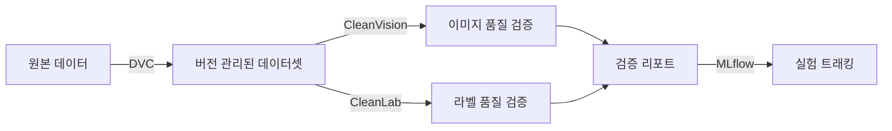

# Layer 2: Data Pipeline

## 개요

데이터 버전 관리, 데이터 품질 검증, 전처리를 담당하는 레이어입니다. DVC로 데이터셋을 버전 관리하고, CleanLab/CleanVision으로 품질을 검증합니다.

## 구성 요소



## DVC (Data Version Control)

### 설정

```bash
# DVC 초기화 + MinIO 리모트 설정
bash scripts/setup_dvc.sh

# 데이터셋 트래킹
dvc add data/raw/cifar10-demo
git add data/raw/cifar10-demo.dvc .gitignore
git commit -m "data: add cifar10-demo dataset"

# MinIO에 업로드
dvc push

# MinIO에서 다운로드
dvc pull
```

### 리모트 저장소

- **저장소**: MinIO `s3://dvc-storage`
- **엔드포인트**: `http://localhost:${MINIO_API_PORT}`
- **설정 파일**: `.dvc/config`

## CleanVision (이미지 품질 검증)

### 검출 항목

| 이슈 | 설명 |
|------|------|
| blurry | 흐릿한 이미지 |
| dark / light | 과도하게 어둡거나 밝은 이미지 |
| exact_duplicates | 완전 동일 이미지 |
| near_duplicates | 거의 동일한 이미지 |
| odd_size | 비정상적 크기 |
| odd_aspect_ratio | 비정상적 비율 |
| low_information | 정보가 적은 이미지 (단색 등) |

### 사용

```python
from src.data.validation import validate_image_dataset

report = validate_image_dataset("data/raw/cifar10-demo/train")
print(f"Health score: {report.health_score:.2f}")
print(f"Issues: {report.issue_types}")
```

## CleanLab (라벨 품질 검증)

### 검출 항목

- 잘못된 라벨 (mislabeled samples)
- 샘플별 라벨 품질 점수 (per-sample quality scores)

### 사용

```python
from src.data.validation import validate_labels

# labels: 정수 라벨 배열, pred_probs: 모델 예측 확률 (cross-validation)
report = validate_labels(labels, pred_probs)
print(f"Issues: {report.issues_found}/{report.total_samples}")
print(f"Avg quality: {report.avg_label_quality:.3f}")
```

> **참고:** CleanLab은 모델의 예측 확률이 필요합니다. Phase 3(Training) 구현 후 cross-validation으로 확률을 생성하여 사용합니다.

## 전처리

```python
from src.data.preprocessing import get_train_transforms, get_eval_transforms

train_transform = get_train_transforms(image_size=224)
eval_transform = get_eval_transforms(image_size=224)
```

- 학습: RandomResizedCrop, HorizontalFlip, ColorJitter, Normalize
- 평가: Resize, CenterCrop, Normalize
- ImageNet 정규화 값 사용 (mean=[0.485, 0.456, 0.406], std=[0.229, 0.224, 0.225])

## 데모 데이터셋

```bash
# CIFAR-10 서브셋 다운로드 (1,200 images: 100 train + 20 val per class)
python examples/image_classification/prepare_demo_data.py
```

디렉토리 구조:
```
data/raw/cifar10-demo/
├── train/          # 1,000 images (100 per class × 10 classes)
│   ├── airplane/
│   ├── automobile/
│   └── ...
└── val/            # 200 images (20 per class × 10 classes)
    ├── airplane/
    ├── automobile/
    └── ...
```

## 의존성

```bash
uv sync    # pyproject.toml의 dependencies 설치
```

주요 패키지: `dvc[s3]`, `cleanlab`, `cleanvision`, `torch`, `torchvision`
