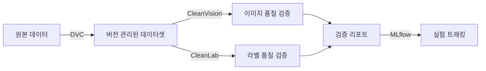

# Layer 2: Data Pipeline

## 개요

데이터 버전 관리, 데이터 품질 검증, 전처리를 담당하는 레이어입니다. DVC로 데이터셋을 버전 관리하고, CleanLab/CleanVision으로 품질을 검증합니다.

## 구성 요소



## DVC (Data Version Control)

### 설정

```bash
# DVC 초기화 + MinIO 리모트 설정
bash scripts/setup_dvc.sh

# 데이터셋 트래킹
dvc add data/raw/cifar10-demo
git add data/raw/cifar10-demo.dvc .gitignore
git commit -m "data: add cifar10-demo dataset"

# MinIO에 업로드
dvc push

# MinIO에서 다운로드
dvc pull
```

### 리모트 저장소

- **저장소**: MinIO `s3://dvc-storage`
- **엔드포인트**: `http://localhost:${MINIO_API_PORT}`
- **설정 파일**: `.dvc/config`

### 데이터 버전 관리 워크플로우

데이터셋 변경 시 DVC로 버전을 관리하고 Git 태그로 추적한다:

```bash
dvc add data/raw/cifar10-demo
git add data/raw/cifar10-demo.dvc data/raw/.gitignore
git commit -m "data: initial dataset"
git tag -a data-v1.0 -m "Initial: 10,000 samples"
dvc push

# 이전 버전으로 복원
git checkout data-v1.0 -- data/raw/cifar10-demo.dvc
dvc checkout data/raw/cifar10-demo.dvc
```

### Prefect 파이프라인 통합

`ensure_data_available` task가 파이프라인 시작 시 `dvc pull`로 데이터를 확보한다.
MLflow가 git 커밋 해시를 자동 기록하므로, `.dvc` 파일로 학습 데이터 버전을 역추적할 수 있다.

## CleanVision (이미지 품질 검증)

### 검출 항목

| 이슈 | 설명 |
|------|------|
| blurry | 흐릿한 이미지 |
| dark / light | 과도하게 어둡거나 밝은 이미지 |
| exact_duplicates | 완전 동일 이미지 |
| near_duplicates | 거의 동일한 이미지 |
| odd_size | 비정상적 크기 |
| odd_aspect_ratio | 비정상적 비율 |
| low_information | 정보가 적은 이미지 (단색 등) |

### 사용

```python
from src.data.validation import validate_image_dataset

report = validate_image_dataset("data/raw/cifar10-demo/train")
print(f"Health score: {report.health_score:.2f}")
print(f"Issues: {report.issue_types}")
```

### 고급 기능

**임계값 커스터마이징**

```python
issue_types = {
    "blurry": {"threshold": 0.3},
    "dark": {"threshold": 0.05},
    "light": {"threshold": 0.05},
    "odd_aspect_ratio": {"threshold": 3.0},
    "low_information": {"threshold": 0.15},
    "exact_duplicates": {},
    "near_duplicates": {"hash_size": 8},
}
imagelab.find_issues(issue_types=issue_types)
```

Pydantic Settings(`CLEANVISION_` prefix)로 환경변수 기반 설정도 가능하다.

**Prefect 아티팩트 연동**

검증 결과를 `create_markdown_artifact()`로 Prefect UI에 기록하면 매 실행마다 데이터 품질 리포트를 확인할 수 있다.

## CleanLab (라벨 품질 검증)

### 검출 항목

- 잘못된 라벨 (mislabeled samples)
- 샘플별 라벨 품질 점수 (per-sample quality scores)

### 사용

```python
from src.data.validation import validate_labels

# labels: 정수 라벨 배열, pred_probs: 모델 예측 확률 (cross-validation)
report = validate_labels(labels, pred_probs)
print(f"Issues: {report.issues_found}/{report.total_samples}")
print(f"Avg quality: {report.avg_label_quality:.3f}")
```

### 파이프라인 통합

CleanLab은 모델의 예측 확률(`pred_probs`)이 필요하다. 학습 후 Post-hoc 방식으로 학습 데이터에 대해 추론하여 확률을 생성한다:

```python
report = validate_labels(labels, pred_probs)
```

`validate_labels_task` Prefect task가 학습 후 자동으로 라벨 품질을 검증한다.
결과는 MLflow 메트릭(`label_issues_found`, `avg_label_quality`)으로 기록된다.

### 고급 기능

**Datalab 통합 감사**

CleanLab의 `Datalab` 클래스를 사용하면 라벨 오류, 아웃라이어, 중복, 클래스 불균형을 한 번에 검사할 수 있다:

```python
from cleanlab import Datalab

lab = Datalab(data=df, label_name="label")
lab.find_issues(pred_probs=pred_probs)
```

## 전처리

```python
from src.data.preprocessing import get_train_transforms, get_eval_transforms

train_transform = get_train_transforms(image_size=224)
eval_transform = get_eval_transforms(image_size=224)
```

- 학습: RandomResizedCrop, HorizontalFlip, ColorJitter, Normalize
- 평가: Resize, CenterCrop, Normalize
- ImageNet 정규화 값 사용 (mean=[0.485, 0.456, 0.406], std=[0.229, 0.224, 0.225])

## 데모 데이터셋

```bash
# CIFAR-10 서브셋 다운로드 (1,200 images: 100 train + 20 val per class)
python examples/image_classification/prepare_demo_data.py
```

디렉토리 구조:
```
data/raw/cifar10-demo/
├── train/    # 1,000 images (100 per class × 10 classes)
└── val/      # 200 images (20 per class × 10 classes)
```

## 의존성

```bash
uv sync    # pyproject.toml의 dependencies 설치
```

주요 패키지: `dvc[s3]`, `cleanlab`, `cleanvision`, `torch`, `torchvision`

## 개선 방향

- **DVC 초기화 완료**: `dvc init` + MinIO 리모트 연결 + 초기 데이터셋 추적
- **CleanLab 파이프라인 연결**: `validate_labels_task`를 training_pipeline에 통합 (현재 함수는 구현되어 있으나 파이프라인에서 호출되지 않음)
- **CleanVision 임계값 설정**: Pydantic Settings 기반 환경변수 설정 도입
- **Prefect 아티팩트**: 검증 결과를 Prefect UI에 기록
- **MLflow 메트릭 로깅**: health_score, label_quality를 MLflow에 기록
