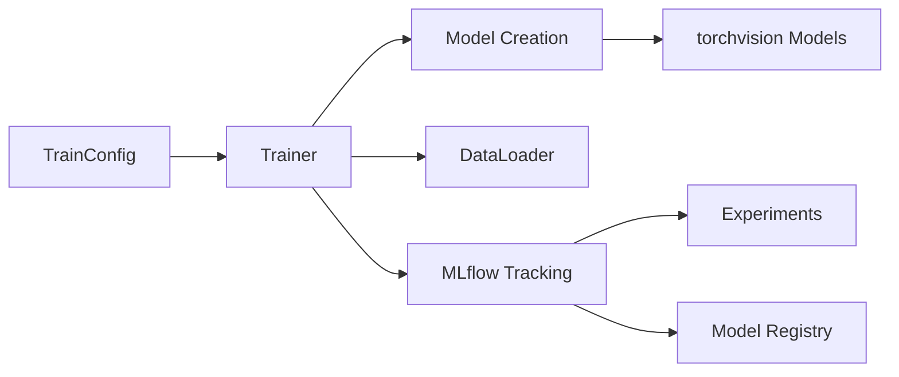

# Layer 3: Training

## 개요

PyTorch 기반 이미지 분류 학습 파이프라인입니다. MLflow로 실험을 트래킹하고 모델을 레지스트리에 등록합니다.

## 구성 요소



## 학습 실행

### 기본 실행 (데모 데이터셋)

```bash
# 데모 데이터셋 준비 (Phase 2)
uv run python examples/image_classification/prepare_demo_data.py

# 학습 실행 (기본 설정: ResNet18, 10 epochs)
uv run python -m src.training.train
```

### 커스텀 설정

```bash
# CLI 인자로 설정
uv run python -m src.training.train \
    --model-name resnet50 \
    --epochs 20 \
    --batch-size 64 \
    --learning-rate 0.0005

# 환경변수로 설정 (TRAIN_ prefix)
TRAIN_MODEL_NAME=efficientnet_b0 TRAIN_EPOCHS=30 uv run python -m src.training.train

# 모델 레지스트리에 등록
uv run python -m src.training.train --registered-model-name ImageClassifier
```

## 지원 모델

| 모델 | 설명 |
|------|------|
| `resnet18` (기본) | 경량 ResNet, 빠른 학습 |
| `resnet34` | 중간 ResNet |
| `resnet50` | 대형 ResNet, 높은 정확도 |
| `efficientnet_b0` | 효율적 아키텍처 |
| `efficientnet_b1` | EfficientNet 확장 |
| `mobilenet_v3_small` | 모바일/엣지 최적화 (소형) |
| `mobilenet_v3_large` | 모바일/엣지 최적화 (대형) |

모든 모델은 ImageNet pretrained weights를 기본 사용합니다.

## 설정 (TrainConfig)

`TrainConfig`는 Pydantic Settings 기반으로, 환경변수(`TRAIN_` prefix) 또는 CLI 인자로 설정합니다.

| 항목 | 기본값 | 설명 |
|------|--------|------|
| `model_name` | `resnet18` | 모델 아키텍처 |
| `num_classes` | `10` | 출력 클래스 수 |
| `pretrained` | `True` | ImageNet pretrained 사용 |
| `epochs` | `10` | 학습 에포크 수 |
| `batch_size` | `32` | 배치 크기 |
| `learning_rate` | `0.001` | 학습률 |
| `weight_decay` | `0.0001` | 가중치 감쇠 |
| `image_size` | `224` | 입력 이미지 크기 |
| `data_dir` | `data/raw/cifar10-demo` | 데이터셋 경로 |
| `num_workers` | `4` | DataLoader 워커 수 |
| `experiment_name` | `default-classification` | MLflow 실험명 |
| `mlflow_tracking_uri` | `http://localhost:5050` | MLflow 서버 URI |
| `registered_model_name` | `None` | 모델 레지스트리명 (None=건너뜀) |
| `device` | `auto` | 디바이스 (auto/cpu/cuda/mps) |

## MLflow 통합

### 자동 트래킹 항목

- **파라미터**: 모델명, 하이퍼파라미터, 데이터 크기
- **메트릭**: train_loss, train_accuracy, val_loss, val_accuracy (에포크별)
- **아티팩트**: 학습된 PyTorch 모델

### 모델 레지스트리

```bash
# 학습 시 모델 등록
uv run python -m src.training.train --registered-model-name ImageClassifier

# MLflow UI에서 모델 버전 관리
# http://localhost:5050/#/models/ImageClassifier
```

## 디바이스 선택

`device` 설정에 따라 자동으로 최적 디바이스를 선택합니다:
1. `auto` (기본): CUDA → MPS → CPU 순서로 사용 가능한 디바이스 선택
2. `cuda`: NVIDIA GPU 사용
3. `mps`: Apple Silicon GPU 사용
4. `cpu`: CPU 사용
