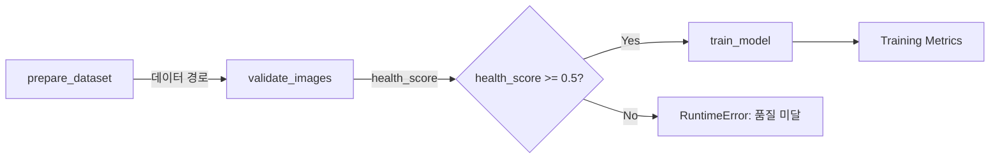
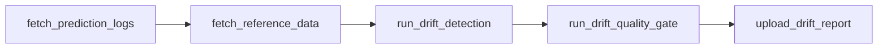

# Layer 4: Orchestration

## 개요

Prefect 기반 워크플로우 오케스트레이션 레이어입니다. 데이터 준비 → 검증 → 학습을 단일 파이프라인으로 엮고, 스케줄링과 에러 핸들링을 제공합니다.

## 학습 파이프라인



## 모니터링 파이프라인

학습 파이프라인과 별도로, 드리프트 모니터링 파이프라인이 예측 데이터의 품질을 감시한다.



수동 실행: `make drift-check`

## 실행 방법

### 파이프라인 1회 실행

```bash
# 기본 설정 (ResNet18, CIFAR-10 데모)
uv run python -m src.orchestration.serve --run-once

# 커스텀 설정
uv run python -m src.orchestration.serve --run-once \
    --model-name resnet50 --epochs 20 --data-dir data/raw/my-dataset
```

### 스케줄링된 배포

```bash
# 매주 월요일 새벽 2시 (기본)
uv run python -m src.orchestration.serve

# 매일 새벽 2시
uv run python -m src.orchestration.serve --cron "0 2 * * *"
```

### Makefile

```bash
make pipeline          # 파이프라인 1회 실행
make pipeline-serve    # 스케줄링 배포 시작
```

## Tasks

| Task | 설명 | 재시도 | 타임아웃 |
|------|------|--------|---------|
| `prepare_dataset` | 데이터셋 존재 및 구조 확인 | 1회 (30초 대기) | - |
| `validate_images` | CleanVision 이미지 품질 검증 | 1회 (10초 대기) | - |
| `train_model` | PyTorch 학습 + MLflow 트래킹 | 없음 | 2시간 |

## 데이터 품질 게이트

파이프라인은 학습 전에 데이터 품질을 검증합니다. `min_health_score` (기본: 0.5) 미만이면 학습을 중단합니다.

```python
# 품질 게이트 비활성화
training_pipeline(min_health_score=0.0)

# 엄격한 품질 요구
training_pipeline(min_health_score=0.9)
```

## 에러 핸들링

- **데이터 누락**: `prepare_dataset`가 `FileNotFoundError` 발생
- **데이터 품질 미달**: 파이프라인이 `RuntimeError` 발생 (health_score 기반)
- **학습 실패**: `train_model` 태스크 실패 → Prefect UI에서 확인 가능
- **학습 타임아웃**: 2시간 초과 시 자동 중단

> MLflow/Prefect 접속 URI는 [Layer 3 문서](layer-3-training.md#접속-uri)와 동일. Docker 내부에서는 `http://mlflow:5000`, `http://prefect-server:4200/api`.

## 고급 기능

### 캐싱

동일 입력에 대해 task 결과를 캐시하여 중복 실행을 방지한다:

```python
from prefect.cache_policies import INPUTS
from datetime import timedelta

@task(cache_policy=INPUTS, cache_expiration=timedelta(hours=1))
def validate_images(data_dir: str) -> dict[str, Any]:
    ...
```

### 아티팩트

검증 결과, 학습 요약 등을 Prefect UI에 기록한다:

```python
from prefect.artifacts import create_markdown_artifact

create_markdown_artifact(key="image-validation", markdown="## Report\n...")
```

### 상태 훅

파이프라인 성공/실패 시 콜백을 실행한다:

```python
def on_training_failure(flow, flow_run, state):
    logger.error("Pipeline '%s' FAILED: %s", flow_run.name, state.message)

@flow(on_failure=[on_training_failure])
def training_pipeline(...):
    ...
```

### 트랜잭션

후속 단계 실패 시 이전 단계를 롤백한다. 학습 후 검증 실패 시 유용하다:

```python
from prefect.transactions import transaction

with transaction():
    metrics = train_model(...)
    # 검증 실패 시 자동 롤백
```

## 개선 방향

| 기능 | 난이도 | 효과 |
|------|--------|------|
| 아티팩트 기록 | 낮음 | Prefect UI에서 즉시 결과 확인 |
| 상태 훅 | 낮음 | 실패/완료 알림 자동화 |
| 캐싱 | 낮음 | 동일 데이터 중복 검증 방지 |
| 트랜잭션 | 중간 | 학습 후 실패 시 롤백 |
| Evidently 자동 스케줄링 | 중간 | `monitoring_pipeline.serve(cron="0 2 * * *")`로 일간 드리프트 감지 |
